# stm32-nucleo-l476rg-gnumake

The repository demonstrates how to import GNU Makefile, generated by CubeMX, into Eclipse and add STM32 debug profile.


## 1. Create Eclipse Project

Launch Eclipse on Mac OS X (as well as other platforms), and select `File / New / Other`, and select `Makefile Project with Existing Code` in C/C++ category:

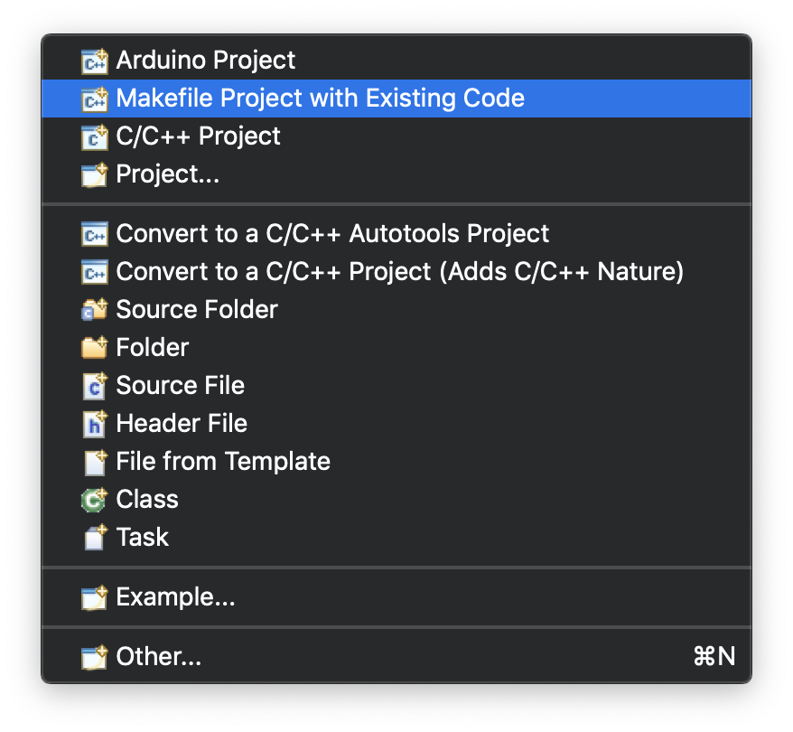

In the project creation wizard dialog, please point the `Existing Code Location` to the [`/cubemx`](/cubemx) directory, and select `Ac6 STM32 MCU GCC` in toolchain list:

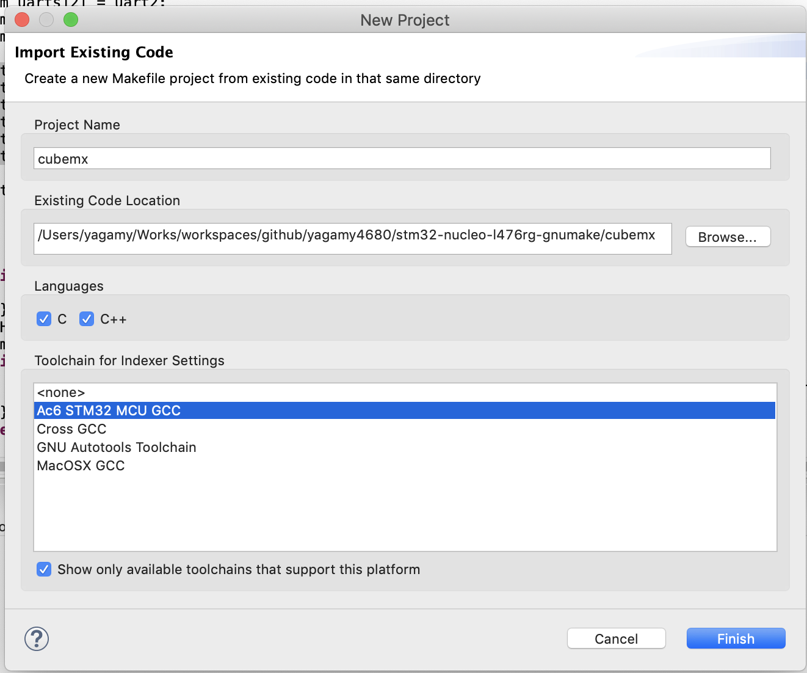

Then, an Eclipse project is created.

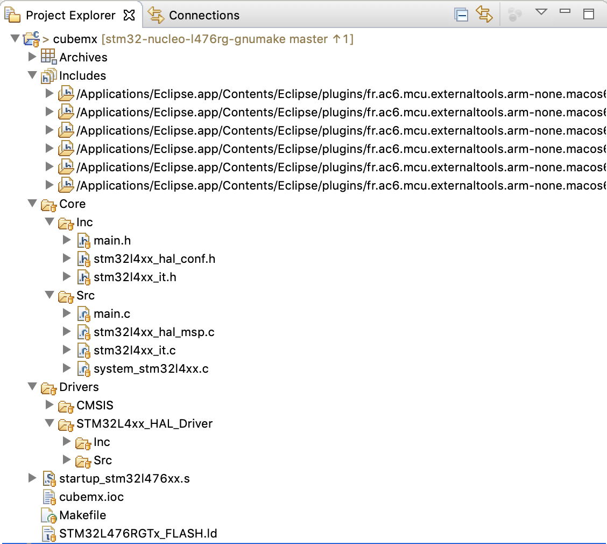


## 2. Build Project

On the project icon, right click to pop up the action menu, and select `Build Project`

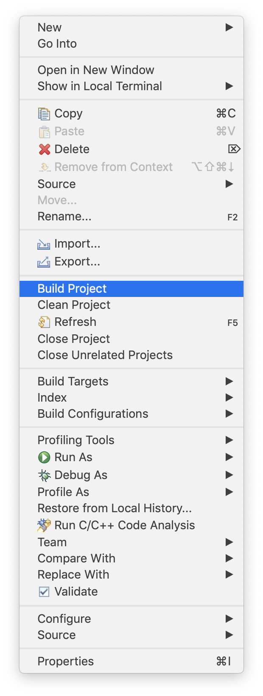


## 3. Update Project for Ac6 STM32 Debugging

The project is still a C/C++ project that just uses cross-compiler to build. We cannot run the project as `Ac6 STM32 C/C++ Application`:

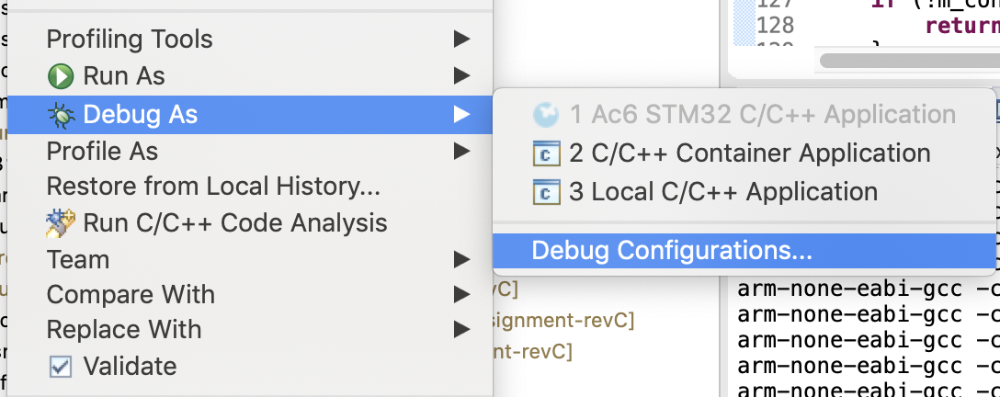

It's required to add Project Nature `MCU Project` to project workspace. First, open project settings:

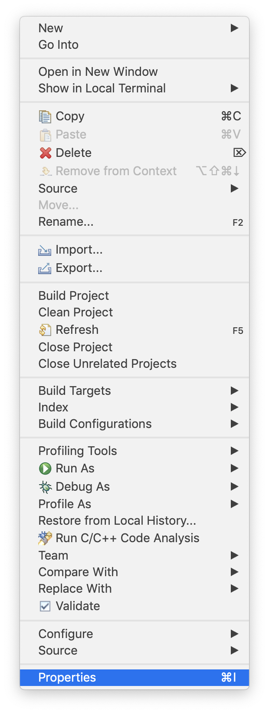

Select Project Natures, and click **ADD** button:

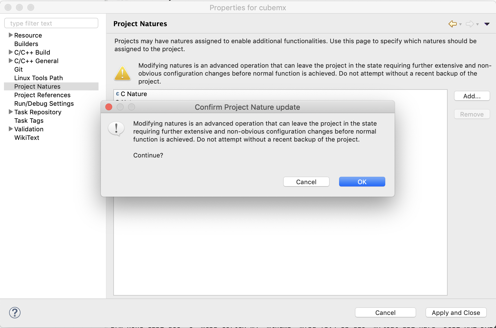

Select `MCU Project` to add:

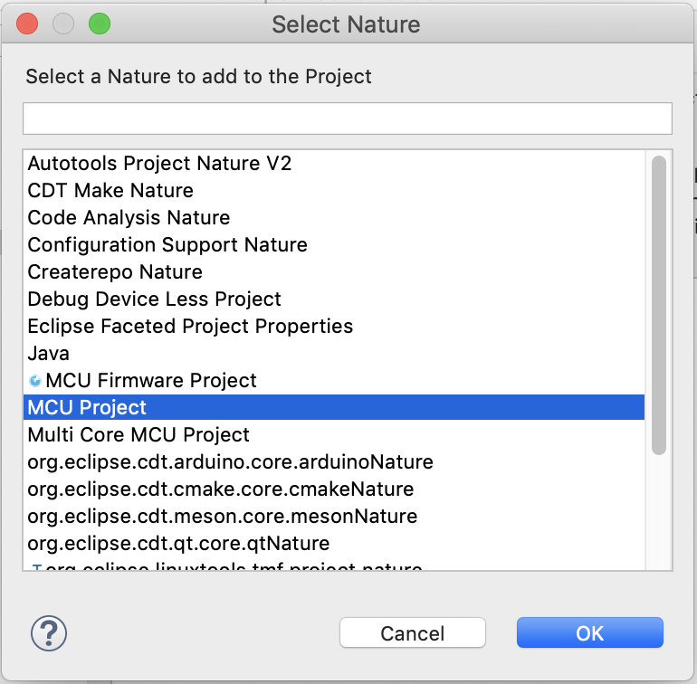

Finally we can run the project as `Ac6 STM32 C/C++ Application`:

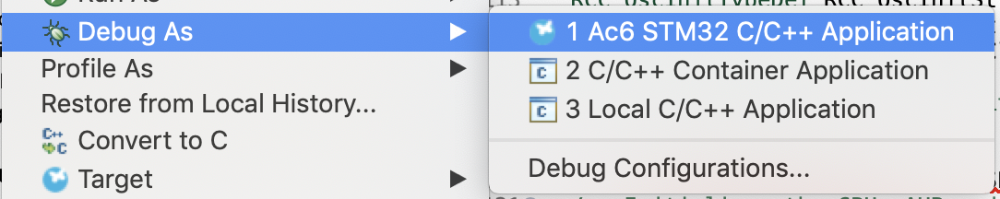


## 4. Add Debugger Profile

Now, we need to add one debugger profile for Eclipse to use as default one. First, please add one openocd script at the project top directory: [`/cubemx/cubemx.cfg`](/cubemx/cubemx.cfg)

```text
# This is an nucleo-l476rg-nfc board with a single STM32L476RGTx chip
#
# Generated by System Workbench for STM32
# Take care that such file, as generated, may be overridden without any early notice. Please have a look to debug launch configuration setup(s)

source [find interface/stlink.cfg]

set WORKAREASIZE 0x8000

transport select "hla_swd"

set CHIPNAME STM32L476RGTx
set BOARDNAME nucleo-l476rg-nfc

# CHIPNAMES state
set CHIPNAME_CPU0_ACTIVATED 1

# Enable debug when in low power modes
set ENABLE_LOW_POWER 1

# Stop Watchdog counters when halt
set STOP_WATCHDOG 1

# STlink Debug clock frequency
set CLOCK_FREQ 8000

# use hardware reset, connect under reset
# connect_assert_srst needed if low power mode application running (WFI...)
reset_config srst_only srst_nogate connect_assert_srst
set CONNECT_UNDER_RESET 1

# BCTM CPU variables

source [find target/stm32l4x.cfg]
```

Select `Debug Configurations` in the popup menu by right clicking project icon:

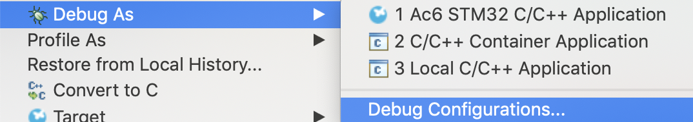

New a debug profile:

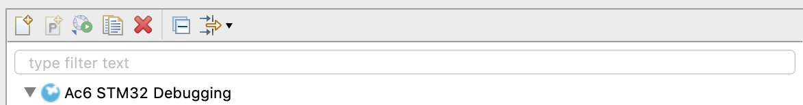

In **Main** tab, click `Search Project` to find `cubemx.elf` from current project

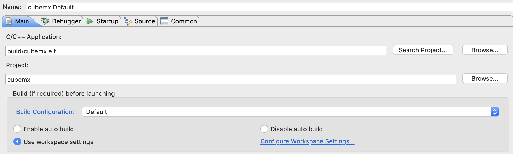

In **Debugger** tab, please fill in these values:

1. GDB command: `${openstm32_compiler_path}/arm-none-eabi-gdb`
2. OpenOCD command: `"${openstm32_openocd_path}/openocd"`
3. OpenOCD port: `3333`
4. OpenOCD Configuration Script: select `User-defined`
5. OpenOCD Configuration Script: fill in Script File with `${ProjDirPath}/cubemx.cfg`

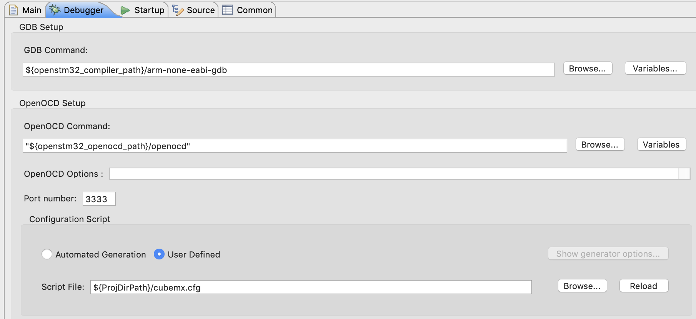

Then, run current app with debugger.
